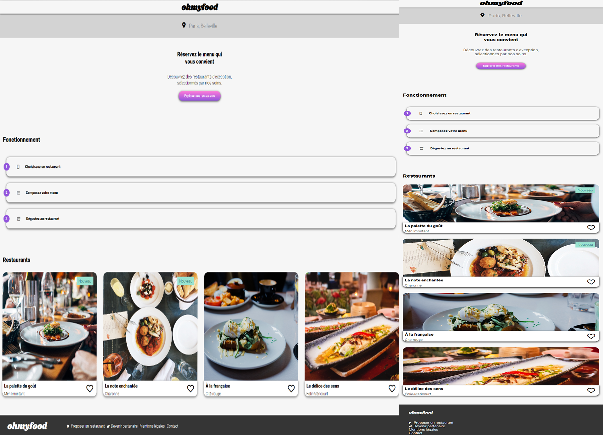

# Oh my Food

#### Screenshots

## Live demo 
 [here](https://mikl291.github.io/Oh-my-Food/)

## Technologies Used
   - HTML 
   - SCSS
#### Font :
- Logo & title : "Shrikhand"
- Text : "Roboto"
- Icons : [this link](https://fontawesome.com/kits/)
#### Colors
-  #9356DC → $colors.primary
-  #FF79DA → $colors.secondary
-  #99E2D0 → $colors.tertiary
-  #F6F6F6 → $lightgrey
-  #353535 → $darkgrey

## Install

    git clone https://github.com/mikl291/Oh-my-Food.git
    
#### Script
    npm run sass
